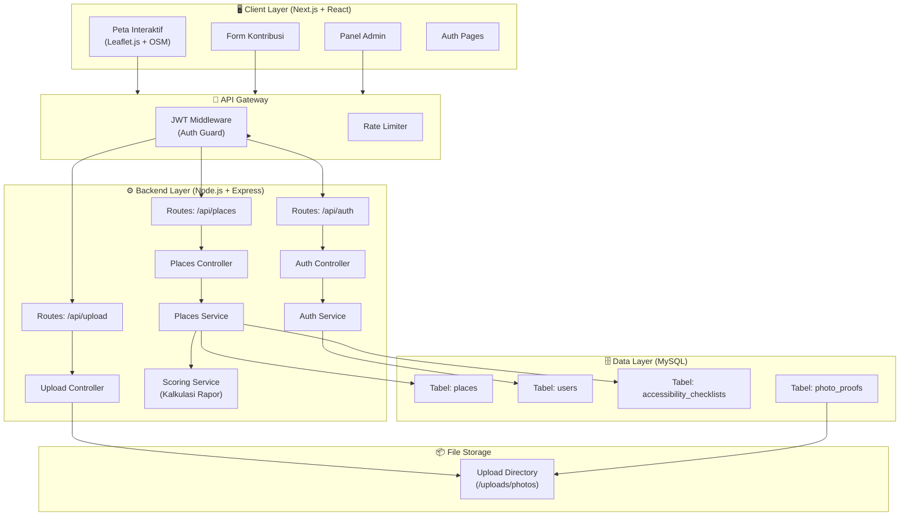
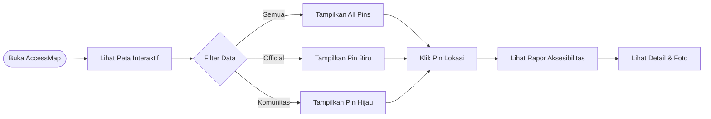
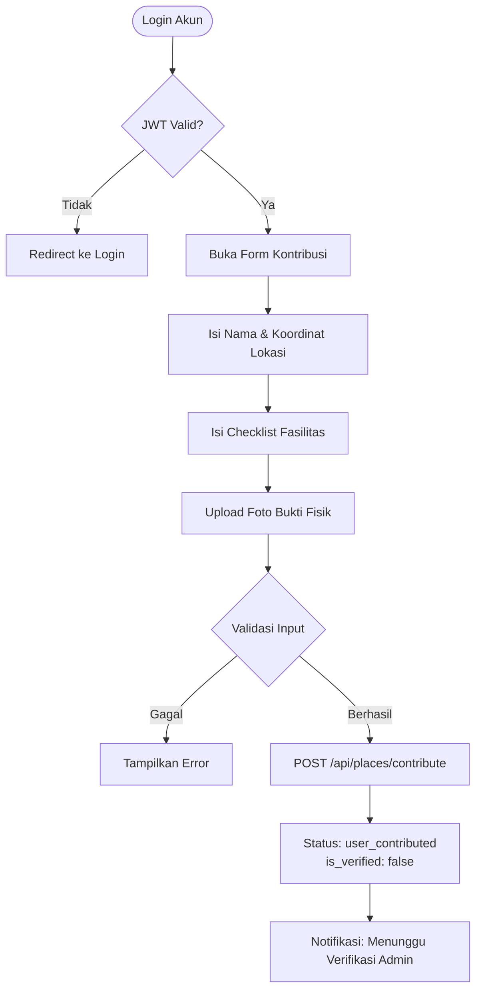
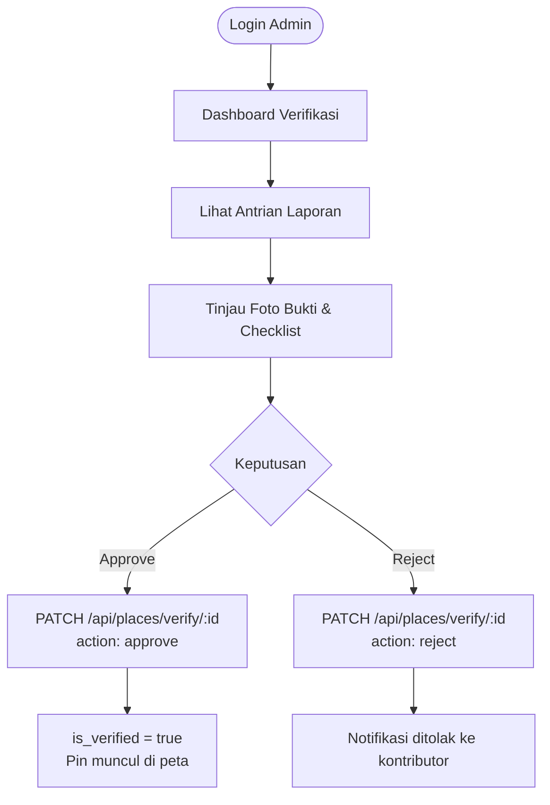
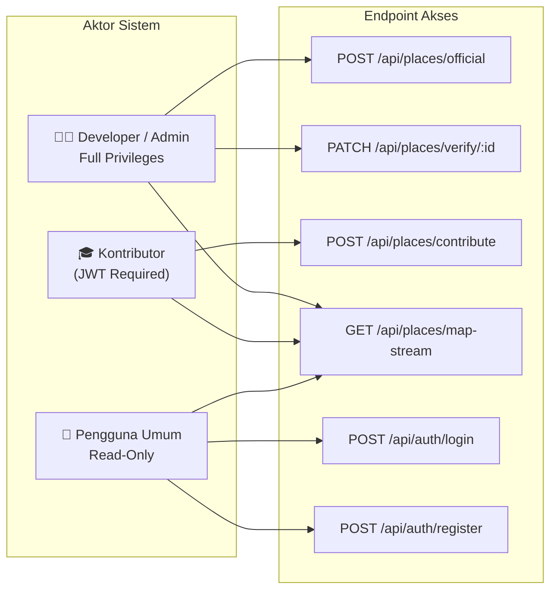

# 🗺️ AccessMap — Peta Akses Inklusif

> Platform GIS interaktif berbasis crowdsourcing untuk memetakan aksesibilitas fasilitas publik bagi penyandang disabilitas.

---

## 📌 Daftar Isi

- [Gambaran Umum](#gambaran-umum)
- [Arsitektur Sistem](#arsitektur-sistem)
- [Workflow Aplikasi](#workflow-aplikasi)
- [Struktur Direktori](#struktur-direktori)
- [Tech Stack](#tech-stack)
- [Peran & Hak Akses](#peran--hak-akses)
- [Fitur Utama](#fitur-utama)
- [Cara Menjalankan](#cara-menjalankan)
- [Dokumentasi Lanjutan](#dokumentasi-lanjutan)

---

## Gambaran Umum

**AccessMap** adalah platform sistem informasi geografis (GIS) interaktif yang memetakan tingkat aksesibilitas fasilitas publik bagi penyandang disabilitas. Aplikasi ini menggabungkan dua sumber data:

| Sumber Data | Keterangan |
|---|---|
| **Official Data** | Data terverifikasi yang dimasukkan oleh Developer/Admin |
| **Crowdsourced Data** | Kontribusi laporan foto & checklist dari mahasiswa/warga |

### Tujuan Utama

- Membantu penyandang disabilitas menemukan fasilitas publik yang aksesibel
- Mendorong partisipasi masyarakat dalam pelaporan kondisi fasilitas
- Menyediakan dasbor pengawasan fasilitas ramah disabilitas berbasis data real-time

---

## Arsitektur Sistem



---

## Workflow Aplikasi

### A. Alur Pengguna Umum (Read-Only)



### B. Alur Kontributor (Laporan Baru)



### C. Alur Admin Verifikasi



---

## Struktur Direktori

```
accessmap/
├── README.md                    ← Dokumen ini
├── docs/
│   ├── prd-frontend.md          ← PRD Frontend (Next.js)
│   ├── prd-backend.md           ← PRD Backend (Express.js) + API Contract + SQL
│   └── prd-mock-server.md       ← PRD Mock Server (JSON placeholders)
│
├── frontend/                    ← Aplikasi Next.js
│   ├── app/
│   │   ├── (public)/
│   │   │   ├── page.tsx         ← Halaman Peta Utama
│   │   │   └── place/[id]/      ← Detail Lokasi
│   │   ├── (auth)/
│   │   │   ├── login/
│   │   │   └── register/
│   │   ├── contribute/          ← Form Kontribusi (protected)
│   │   └── admin/               ← Panel Admin (protected)
│   ├── components/
│   │   ├── map/                 ← Komponen Leaflet.js
│   │   ├── ui/                  ← Reusable UI Components
│   │   └── forms/               ← Form Components
│   ├── lib/
│   │   ├── api.ts               ← API Client
│   │   └── auth.ts              ← Auth Helpers
│   └── public/
│
├── backend/                     ← Server Node.js + Express
│   ├── src/
│   │   ├── routes/
│   │   │   ├── places.routes.js
│   │   │   ├── auth.routes.js
│   │   │   └── upload.routes.js
│   │   ├── controllers/
│   │   │   ├── places.controller.js
│   │   │   ├── auth.controller.js
│   │   │   └── upload.controller.js
│   │   ├── services/
│   │   │   ├── places.service.js
│   │   │   ├── auth.service.js
│   │   │   └── scoring.service.js
│   │   ├── middlewares/
│   │   │   ├── auth.middleware.js  ← JWT Verification
│   │   │   └── upload.middleware.js ← Multer Config
│   │   ├── models/              ← Query definitions
│   │   └── config/
│   │       └── db.js
│   ├── uploads/                 ← Foto bukti fisik
│   └── app.js
│
└── mock-server/                 ← Mock API (json-server / msw)
    ├── db.json
    └── routes.json
```

---

## Tech Stack

| Layer | Teknologi | Keterangan |
|---|---|---|
| **Frontend** | Next.js 14 (App Router) | React framework dengan SSR/SSG |
| **UI Components** | Tailwind CSS + shadcn/ui | Styling & komponen siap pakai |
| **Peta** | Leaflet.js + OpenStreetMap | Peta interaktif gratis, ringan |
| **Backend** | Node.js + Express.js | REST API server |
| **Database** | MySQL | Relational database |
| **Query Builder** | mysql2 (raw query) | Koneksi DB langsung tanpa ORM |
| **Auth** | JWT (jsonwebtoken) | Autentikasi stateless |
| **File Upload** | Multer | Middleware upload foto |
| **Mock Server** | json-server | Placeholder API development |
| **Dev Tools** | Nodemon, ESLint, Prettier | Developer experience |

---

## Peran & Hak Akses



| Role | Deskripsi | Akses |
|---|---|---|
| **Developer/Admin** | Memasukkan data resmi, memvalidasi laporan | Full (semua endpoint) |
| **Kontributor** | Mahasiswa/warga yang melapor via akun | Terbatas (kontribusi + baca) |
| **Pengguna Umum** | Penyandang disabilitas / masyarakat umum | Read-Only (tanpa login) |

---

## Fitur Utama

### 1. 🗺️ Peta Interaktif & Filter Status
Menampilkan semua titik lokasi dengan penanda warna berbeda:
- 🔵 **Biru** — Data resmi dari Developer (terverifikasi)
- 🟢 **Hijau** — Kontribusi komunitas terverifikasi
- 🟡 **Kuning** — Kontribusi komunitas, menunggu verifikasi

### 2. 📋 Rapor Aksesibilitas
Setiap lokasi memiliki rapor persentase yang dihitung dari checklist fasilitas:
- Ramp kursi roda
- Toilet ramah disabilitas
- Jalur tunanetra (guiding block)
- Area parkir khusus
- Pintu otomatis / lebar
- Lift / akses vertikal

### 3. 📤 Form Kontribusi (Kontributor)
Kontributor dapat menambahkan lokasi baru dengan:
- Input koordinat atau pin di peta
- Checklist fasilitas yang tersedia
- Upload foto bukti fisik (wajib)

### 4. ✅ Panel Verifikasi (Admin)
Admin dapat meninjau dan menyetujui/menolak laporan kontributor berdasarkan foto bukti fisik yang diunggah.

### 5. 🔐 Autentikasi JWT
Sistem keamanan berlapis menggunakan JSON Web Token untuk memisahkan hak akses antar role pengguna.

---

## Cara Menjalankan

### Prasyarat
- Node.js >= 18.x
- MySQL >= 8.x
- npm atau yarn

### 1. Clone & Install

```bash
git clone https://github.com/your-org/accessmap.git
cd accessmap

# Install backend dependencies
cd backend && npm install

# Install frontend dependencies
cd ../frontend && npm install
```

### 2. Setup Environment

```bash
# backend/.env
DB_HOST=localhost
DB_PORT=3306
DB_USER=root
DB_PASSWORD=yourpassword
DB_NAME=accessmap_db
JWT_SECRET=your_super_secret_key
JWT_EXPIRES_IN=7d
PORT=5000
UPLOAD_PATH=./uploads

# frontend/.env.local
NEXT_PUBLIC_API_URL=http://localhost:5000
NEXT_PUBLIC_MAP_CENTER_LAT=-6.914744
NEXT_PUBLIC_MAP_CENTER_LNG=107.609810
```

### 3. Setup Database

```bash
cd backend
mysql -u root -p < src/config/schema.sql
```

### 4. Jalankan Server

```bash
# Terminal 1 — Backend
cd backend && npm run dev

# Terminal 2 — Frontend
cd frontend && npm run dev

# Terminal 3 — Mock Server (opsional, untuk development)
cd mock-server && npx json-server db.json --port 3001
```

### 5. Akses Aplikasi

| Service | URL |
|---|---|
| Frontend | http://localhost:3000 |
| Backend API | http://localhost:5000 |
| Mock Server | http://localhost:3001 |

---

## Dokumentasi Lanjutan

| Dokumen | Deskripsi |
|---|---|
| [`docs/prd-frontend.md`](./docs/prd-frontend.md) | PRD lengkap Frontend: komponen, halaman, state management, workflow UI |
| [`docs/prd-backend.md`](./docs/prd-backend.md) | PRD lengkap Backend: API Contract, SQL schema, service logic, middleware |
| [`docs/prd-mock-server.md`](./docs/prd-mock-server.md) | PRD Mock Server: struktur data JSON, endpoint simulasi |

---

## Batasan Scope

> ⚠️ AccessMap **bukan** aplikasi navigasi rute seperti Google Maps.

Fokus aplikasi ini hanya pada:
- ✅ Pemetaan & visualisasi lokasi
- ✅ Penilaian & rapor aksesibilitas
- ✅ Validasi foto bukti fisik
- ❌ Navigasi turn-by-turn
- ❌ Real-time traffic
- ❌ Pemesanan transportasi

---

*AccessMap — Tugas Besar Mata Kuliah Literasi Manusia & Teknologi*  
*Stack: Next.js · Express.js · MySQL · Leaflet.js*
